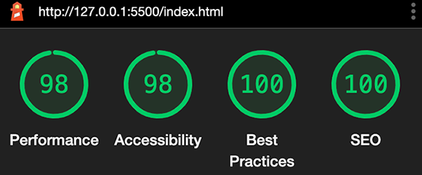
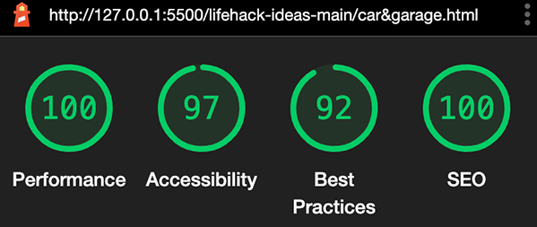
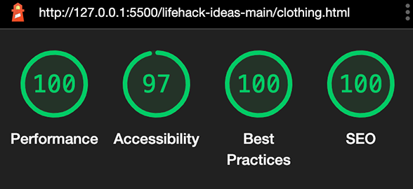
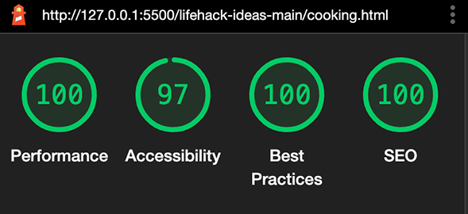
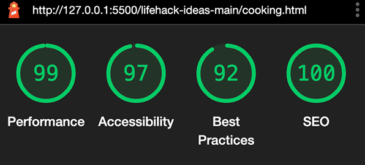
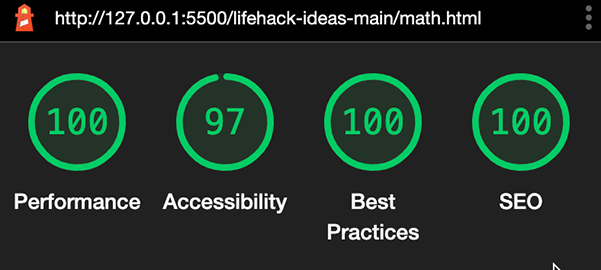
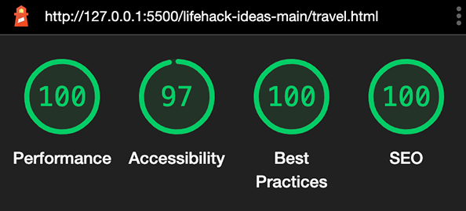
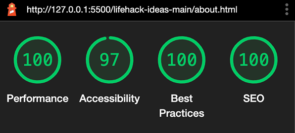
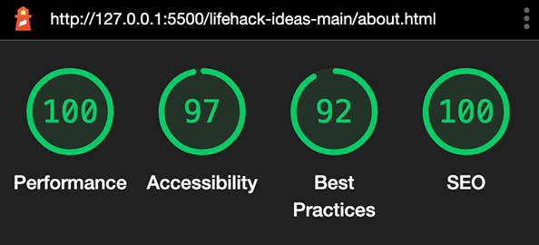
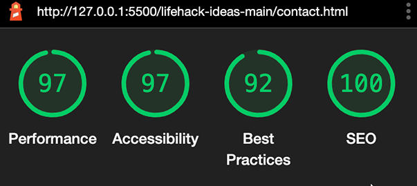

# Day-To-Day Life Hack ideas

The "Day-To-Day Life Hack ideas" website offers a collection of life hack ideas that, if used, will speed up many of the boring tasks we do every day and solve many problems with a non obvious fix. They are also divided into categories to make it easier to find them. The
website is designed to be responsive website allowing visitors to view browse it on a range of devices.

[Check out Life Hack Ideas on Github](https://lucagiarr.github.io/lifehack-ideas/)

## CONTENTS

* [User Experience (UX)](#User-Experience-(UX))
  * [Initial Discussion](#Initial-Discussion)

* [Design](#Design)
  * [Colour Scheme](#Colour-Scheme)
  * [Typography](#Typography)
  * [Imagery](#Imagery)
  * [Wireframes](#Wireframes)
  * [Features](#Features)
  * [Accessibility](#Accessibility)

* [Technologies Used](#Technologies-Used)
  * [Languages Used](#Languages-Used)
  * [Frameworks, Libraries & Programs Used](#Frameworks,-Libraries-&-Programs-Used)

* [Deployment & Local Development](#Deployment-&-Local-Development)
  * [Deployment](#Deployment)
  * [Local Development](#Local-Development)
    * [How to Fork](#How-to-Fork)
    * [How to Clone](#How-to-Clone)

* [Testing](#Testing)
  * [W3C Validator](#W3C-Validator)
  * [Lighthouse](#Lighthouse)
    * [Index Page](#Index-Page)
    * [All Page](#All-Page)
    * [Car & Garage Page](#Car-&-Garage-Page)
    * [Clothing Page](#Clothing-Page)
    * [Cooking Page](#Cooking-Page)
    * [Math Page](#Math-Page)
    * [Travel Page](#Travel-Page)
    * [Other Page](#Other-Page)
    * [About Page](#About-Page)
    * [Contact Page](#Contact-Page)
  * [Full Testing](#Full-Testing)
  
* [Credits](#Credits)
  * [Code Used](#Code-Used)
  * [Content](#Content)
  * [Media](#Media)
  * [Acknowledgments](#Acknowledgments)

- - -

## User Experience (UX)

### Initial Discussion

The "Day-To-Day Life Hack ideas" website offers a collection of ideas that can be seen and filtered into categories so that the user can easily see the ones he/she is interested in.

#### Key information for the site

* Collection of Life Hack ideas.
* Selectable categories.
* A way for people to contact the owner of the website and share their personal life hack solutions to problems that they use in their lives.

#### Client Goals

* To be able to view the website on a range of devices with different screen sizes and resolutions.
* To make it easy for the user to browse and choose to see just the life hack ideas of the categories they are interested in.
* To allow people to contact the owner of the website to share their personal life hacks solutions.

#### Visitor Goals

* I want to be able to navigate the site easily to find information.
* I want to be able to filter the ideas of the categories I am interested in.
* I want to be able to contact the owner of the website to share my personal life hacks solutions and to get them published.

- - -

## Design

### Colour Scheme

The predominant colour used in the website is the navy blue matched with white and yellow text in the header, navigation bar and footer. The text of the life hack items is black. The colour palette was created using the [Coolors](https://coolors.co/) website.

### Typography

Google Fonts was used for the following fonts:

* Lato is used for the title and for the navigation links on the site.

* Oswald is used for the text just below the title on the site.

* Roboto is used for the body text on the site.

### Imagery

The life hack items images were taken from the web. I have credited these in the [credits](#Credits) section.

### Wireframes

Wireframes drawn by hand were created for mobile, tablet and desktop.

[Home Page Wireframe (desktop)](docs/wireframes/wireframe_desktop.JPG)

[Home Page Wireframe (tablet)](docs/wireframes/wireframe_tablet.JPG)

[Home Page Wireframe (mobile)](docs/wireframes/wireframe_mobile.JPG)

### Features

The website is comprised of ten pages, seven of which are accessible from the categories menu on the left of each page (in the desktop view) or in the toggler burger menu (in the tablet and mobile view). The other 3 pages are the Home, About and Contact pages which are accessible from the links on the top right of the pages (in the desktop view) or in the toggler burger menu in the tablet and mobile views.

* All Pages on the website have:

  * A navy blue header at the top of the page with the title of the website. On the up-left corner there is the logo and below the logo there is the navy blue navigation bar with the links to the life hack categories. At the top-right corner there are three links to the Home, About and Contact pages. For a better user experience of the site, the menu categories will change to a menu hamburger, including the Home, About and Contact links. Furthermore, the header and footer have a reduced size in the mobile view.
  
  * A section with the life hack items that are relative to the category page selected with a "return to top" function on the bottom right of the page. 

  * A footer which contains social media icon links to facebook, instagram, twitter and github. For a cleaner look, the footer is included in the toggler burger menu in the case of screen heights less than 800px in the About, Contact and those pages that have just one row of life hack items (car & garage and other).

  

* About Page.

  This page gives users some information on the website. This is shown foreground above the life hack items shown in transparency.

  

* Contact Page.
  * Form

  The form contains fields for the users name, email address and a text area for the user to send a message or share their day-to-day life hacks. The form is shown foreground above the life hack items shown in transparency. The user submits the form using the submit button. Users must fill in the name, email and text area fields to be able to submit the form. If they don't a tooltip will guide them to fill in any information they have missed.

  

* Future Implementations.

  * Add more life hack items and categories.

### Accessibility

To guarantee to all users to browse the website, including the ones with disabilities, I added as many features required as possible to make sure the disability barriers are overcome by:

* Using semantic HTML.
* Using descriptive alt attributes on images.
* Providing information for screen readers where there are icons with no text such as the footer icons.
* Ensuring that there is a sufficient colour contrast throughout the site.
* By marking the current page as current for screen readers.

- - -

## Technologies Used

### Languages Used

HTML and CSS were used to create this website.

### Frameworks, Libraries & Programs Used

Git - For version control.

Github - To save and store the files for the website.

Google Fonts - To import the fonts used on the website.

Font Awesome - For the iconography on the website.

Google Dev Tools - To troubleshoot and test features, solve issues with responsiveness and styling.

[Tiny PNG](https://tinypng.com/) To compress images.

[Am I Responsive?](http://ami.responsivedesign.is/) To show the website image on a range of devices.

- - -

## Deployment & Local Development

### Deployment

Github Pages was used to deploy the live website. The instructions to achieve this are below:

1. Log in (or sign up) to Github.
2. Find the repository for this project, lifehack-ideas.
3. Click on the Settings link.
4. Click on the Pages link in the left hand side navigation bar.
5. In the Source section, choose main from the drop down select branch menu. Select Root from the drop down select folder menu.
6. Click Save. Your live Github Pages site is now deployed at the URL shown.

### Local Development

#### How to Fork

To fork the lifehack-ideas repository:

1. Log in (or sign up) to Github.
2. Go to the repository for this project, LucaGiarr/lifehack-ideas.
3. Click the Fork button in the top right corner.

#### How to Clone

To clone the lifehack-ideas repository:

1. Log in (or sign up) to GitHub.
2. Go to the repository for this project, LucaGiarr/lifehack-ideas.
3. Click on the code button, select whether you would like to clone with HTTPS, SSH or GitHub CLI and copy the link shown.
4. Open the terminal in your code editor and change the current working directory to the location you want to use for the cloned directory.
5. Type 'git clone' into the terminal and then paste the link you copied in step 3. Press enter.

- - -

## Testing

Testing was ongoing throughout the entire build. I utilised Chrome developer tools while building to pinpoint and troubleshoot any issues as I went along.

The following issues were raised during my mid project meeting with my mentor:

* The images were had different size and height to width ratio. The images now have same size (height 320px, width 380px).
* The font-size in the About page was small. The font-size is now 16px.
* On the Contact page, the link to the form-handler was missing. The name attribute in the input for name and email was missing. They have been added now. 

### W3C Validator

The W3C validator was used to validate the HTML on all pages of the website. It was also used to validate CSS in the style.css file.

* [Index Page HTML](docs/testing/w3c/w3c_index.png)
* [All Page HTML](docs/testing/w3c/w3c_all.png)
* [Car&garage Page HTML](docs/testing/w3c/w3c_car&garage.png)
* [Clothing Page HTML](docs/testing/w3c/w3c_clothing.png)
* [Cooking Page HTML](docs/testing/w3c/w3c_cooking.png)
* [Math Page HTML](docs/testing/w3c/w3c_math.png)
* [Travel Page HTML](docs/testing/w3c/w3c_travel.png)
* [Other Page HTML](docs/testing/w3c/w3c_other.png)
* [About Page HTML](docs/testing/w3c/w3c_about.png)
* [Contact Page HTML](docs/testing/w3c/w3c_contact.png)
* [style.css CSS](docs/testing/w3c/w3c_style_css.png) ~ 
  [style.css CSS](docs/testing/w3c/w3c_style_css_2.png)

### Lighthouse

I used Lighthouse within the Chrome Developer Tools to test the performance, accessibility, best practices and SEO of the website.

#### Index Page

Lighthouse testing:

 ~

#### All Page

Lighthouse testing:

 ~

#### Car & Garage Page

Lighthouse testing:

 ~

#### Clothing Page

Lighthouse testing:

 ~

#### Cooking Page

Lighthouse testing:

 ~

#### Math Page

Lighthouse testing:

 ~

#### Travel Page

Lighthouse testing:

 ~

#### Other Page

Lighthouse testing:

 ~

#### About Page

Lighthouse testing:

 ~

#### Contact Page

Lighthouse testing:

 ~

### Full Testing

To fully test my website I performed the following testing using two different browsers (google chrome and safari) and devices (Macbook Pro 13 inch, iPhone 12 pro).

Furthermore, I went through each page using the google chrome developer tool to make sure that the pages are responsive on all different screen sizes.

Links.

1. Test each link on all pages. Each link worked as expected, and any link leading to external pages opened correctly in a seperate browser tab.

Contact Form.

1. Test the contact form. I tried to submit the form without filling in any input fields. The form directed me to insert the name. I then filled in the name field and tried to submit the form. Again the form asked to insert the email in the email field. I filled also out the email field and tried to submit the form. The form then asked me to fill in the text area field. I filled also the text area field and tried to submit the form. The form then opens the code institute page https://formdump.codeinstitute.net/ with the info I inserted in the field in the same browser window.

2. I tried then all the combinations by filling first in just the email address or just the text area and every time the form directed me to fill in the other two fields before submitting the form.

- - -

## Credits

### Code Used

* [Tutorial to build a sliding CSS Menu without JavaScript](https://www.youtube.com/watch?v=x_VYl7zz1XY&t=482s)

### Content

Content for the website was written by Luca Giarrusso.

### Media

#### Life Hack items Images

* Each image was taken from the website linked below:

[oberlo.com](https://www.oberlo.com) 

[lifehack.org](https://www.lifehack.org)

[headout.com](https://www.headout.com)

[rd.com](https://www.rd.com)

[shutterstock.com](https://www.shutterstock.com/it/g/photojog)

[tasteofhome.com](https://www.tasteofhome.com)

[hunker.com](https://www.hunker.com)

[imgur.com](https://www.imgur.com)

[cargurus.com](https://www.cargurus.com)

[1000lifehacks.com](https://www.1000lifehacks.com)

[reddit.com](https://www.reddit.com)

[ducksters.com](https://www.ducksters.com)

#### Other Images

* Life Hack Ideas Logo - made by Valentina Rainato.

### Acknowledgments

I would like to acknowledge the following people who helped me along the way in completing my first milestone project:

* Antonio Rodriguez, my Code Institute Mentor.
* [Kera Cudmore](https://github.com/kera-cudmore), for the fantastic README file example that I used to write this file.

